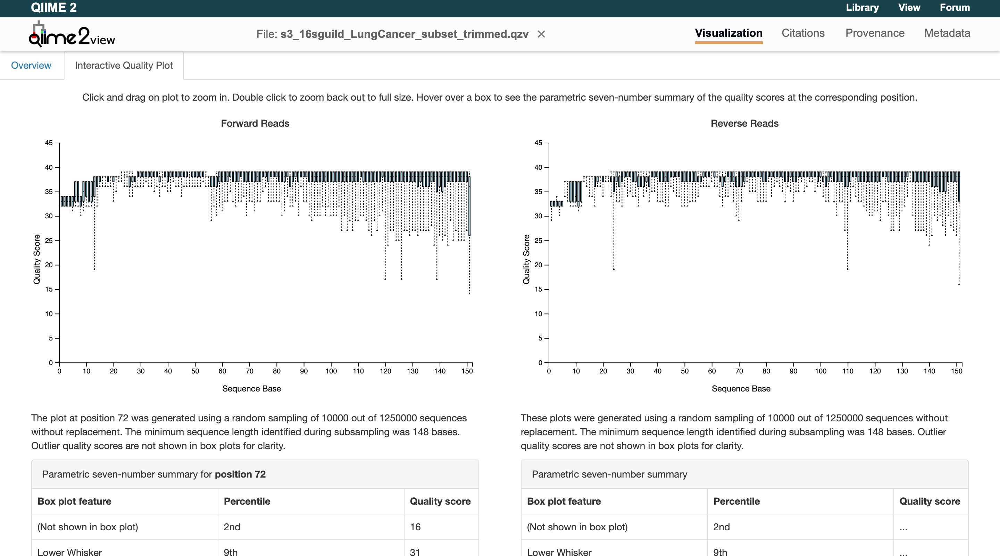
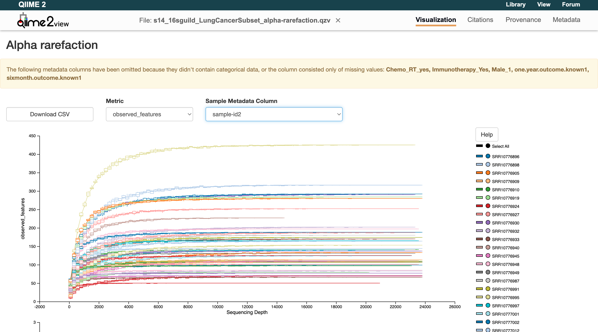

<div align="center">
    
</div>

# Basic Workflow

An initial, simple workflow for guild-based analysis of 16S-rRNA sequencing data based on [Wu and Zhao et al., 2021](https://genomemedicine.biomedcentral.com/articles/10.1186/s13073-021-00840-y).

---

## Introduction

??? info "Information block"
    These blocks contain general information about pipeline use. They may include suggestions or information about what is happening within a step.

??? nextflow "Nextflow block"
    These blocks contain information about the use of Nextflow to build this pipeline.

??? param "Parameters block"
    These blocks contain information about the parameters that will be included in the `params.yml` input for the pipeline.

In this vignette, we walk through how to run the pipeline step by step. Users can follow along by running the code chunks alongside this demonstration. The example dataset is a random subset of samples taken from a study by [Tsay et al., 2021](https://pmc.ncbi.nlm.nih.gov/articles/PMC7858243) completed at New York University (NYU) ([ENA Project: PRJNA592147](https://www.ebi.ac.uk/ena/browser/view/PRJNA592147), [GitHub](https://github.com/segalmicrobiomelab/lung_cancer_prognosis_microbiome)). The subset consists of 50 random samples taken from lung cancer patients, collected by an airway brush. These samples have been subset down by approximately half of the number of reads to 25,000. These samples will be referred to as NYU from here on out.

??? info "Background"

    The human microbiome is composed of trillions of microorganisms, including bacteria, archaea, viruses, and fungi. Understanding the composition and diversity of these communities is critical for studying their role in health and disease. One of the most widely used methods for profiling bacterial communities is targeted DNA sequencing of the 16S rRNA gene.

    When analyzing this data, the sequences are corrected for sequencing errors using tools such as DADA2 (Calahan et al., 2016). These unique DNA sequences are known as amplicon sequence variants (ASVs). ASVs are a unique DNA sequence of the target region (e.g., V4) that is distinguished from all others by even a single nucleotide. These ASVs provide higher resolution, reproducibility across studies, and the ability to detect fine-scale differences in microbial communities when compared to conventional taxonomic approaches.

    We have created a novel method for looking at the microbiome as an ecosystem of high-resolution ASV units that interact with each other in correlated ways based on function. These interacting modules are called **guilds**: ecologically coherent groups that respond together to environmental inputs, perform complementary metabolic functions, and compete or cooperate as groups.

    In this pipeline, individual microbial entities—ASVs—are identified and tagged with a universal unique identifier (UUID) for precise tracking. This approach is database-independent, avoiding limitations of incomplete or biased reference databases. Rather, the UUIDs are stored in a [database](https://biostats-dashboard.kumc.edu/16SguildDB/) with their unique, unchanging ASV sequence. These ASVs are clustered into co-abundance groups based on co-abundance behavior, which may represent guilds where members share ecological niches and exhibit similar abundance patterns.

??? nextflow "About Nextflow"

    The 16sguild pipeline has been built using [Nextflow](https://www.nextflow.io/docs/latest/overview.html#why-nextflow). Nextflow is a language that allows users to chain different processes together across programming languages that run on Linux.

    One massively useful feature of Nextflow is the `-resume` flag. This allows users to resume the pipeline, picking up where it left off by caching, without re-running everything up to that point.

    Another useful feature is that Nextflow can run steps in parallel. This means it can divide samples, process them on different CPUs, and bring them together at the end before continuing to the next step.

    Nextflow also allows for the pipeline to be run using containers, ensuring reproducibility on all operating systems.

---

## Installation

To install `16Sguild`, users can directly call the pipeline using Nextflow from GitHub:

```bash
nextflow run zhao-microbiome-lab/16Sguild/main.nf -params-file examples/params.yml -profile test
```

Or, users can choose to download and run from the source file:

```bash
git clone https://github.com/zhao-microbiome-lab/16Sguild.git
cd 16Sguild
nextflow run main.nf -params-file examples/params.yml -profile test
```

Please keep in mind that the `-profile test` is only to run the NYU example data.

For HPC users, you will need to specify the workload manager under the `-profile` as well. For example: `-profile slurm,test`

---

## Example Data

Download Required Example Data Files

[](https://biostats-shinyr.kumc.edu/16SguildDB_ExampleData/NYU_Example_FASTQ_Files.zip)

[](test/manifest.csv)

[](test/metadata.txt)

---

## Input Files

Users are required to have certain input files to run the 16Sguild pipeline:

- Manifest
- Metadata
- Parameters

### Manifest

First, users set up their manifest file. This file contains the sample-id, absolute file path, and direction.

??? info "Manifest"

    The manifest represents two paired-end samples in FASTQ format, each consisting of forward and reverse reads, organized according to QIIME2's manifest specification: [`qiime tools import`](https://docs.qiime2.org/2024.10/tutorials/importing/).

    Below is an example of what the file would look like for 2 samples:

    **`input/manifest.csv`**

    ```
    sample-id,absolute-filepath,direction
    Sample1,/files/Sample1_1.fastq,forward
    Sample1,/files/Sample1_2.fastq,reverse
    Sample2,/files/Sample2_1.fastq,forward
    Sample2,/files/Sample2_2.fastq,reverse
    ```

    | sample-id | absolute-filepath | direction |
    |-----------|-------------------|-----------|
    | Sample1 | /files/Sample1_1.fastq | forward |
    | Sample1 | /files/Sample1_2.fastq | reverse |
    | Sample2 | /files/Sample2_1.fastq | forward |
    | Sample2 | /files/Sample2_2.fastq | reverse |

### Metadata

Users now set up their metadata file. This contains additional information about the samples, such as cancer status, cohort, age, sex, etc. `16Sguild` requires the first column header to be `sample-id` and the other columns can be named as desired.

??? info "Metadata"

    The `metadata` is a text file which identifies associated metadata with the sample-id as coded in the `input/manifest.csv` document. Unlike the `manifest.csv`, the `metadata` can only have unique samples listed (no duplicates).

    Here is an example of what this file may look like for 2 samples:

    **`input/metadata.txt`**

    | sample-id | cohort | cancer status | sex |
    |-----------|--------|---------------|-----|
    | Sample 1 | 2024 | Active cancer | F |
    | Sample 2 | 2024 | Benign tumor | M |

### Parameters

The parameters file contains project-specific information required to run the pipeline. Here are the initial parameters:

```groovy
samplesheet: "manifest.csv"
metadata: "metadata.txt"
base_name: "16sguild_Example"
input_type: "SampleData[PairedEndSequencesWithQuality]"
input_format: "PairedEndFastqManifestPhred33"
trim_forward: "GTGCCAGCMGCCGCGGTAA"
trim_reverse: "GGACTACHVGGGTWTCTAAT"
```

In order to use `16Sguild`, users need to create a project-specific parameters file, usually named `params.yml`. Detailed definitions for each parameter are included on the [parameters page](parameters.md).

??? param "samplesheet"

    The `samplesheet` points to the `manifest` CSV file. This manifest file is in the format expected for the [`qiime tools import`](https://docs.qiime2.org/2024.10/tutorials/importing/) function.

??? param "metadata"

    The `metadata` is a text file which identifies associated metadata with the sample-id as coded in the `input/manifest.csv` document. Unlike the `manifest.csv`, the `metadata` can only have unique samples listed (no duplicates).

??? param "base_name"

    The `base_name` identifies the project name and will be added to the output files. The default is `16Sguild`.

??? param "input_type"

    The `input_type` refers to the type of sequencing performed: single-end or paired-end. QIIME2 requires the sequencing be identified as `"SampleData[SequencesWithQuality]"` for single-end or `"SampleData[PairedEndSequencesWithQuality]"` for paired-end. **At this time, the 16Sguild pipeline only accepts paired-end sequencing.**

??? param "input_format"

    The `input_format` refers to the type of fastq manifest file. Common types include:

    - `"PairedEndFastqManifestPhred33"`
    - `"PairedEndFastqManifestPhred64"`
    - `"CasavaOneEightSingleLanePerSampleDirFmt"`

    More information can be found on the [QIIME tutorial website](https://docs.qiime2.org/2024.10/tutorials/importing/) under the "Fastq Manifest" formats section.

??? param "trim_forward / trim_reverse"

    Both `trim_forward` and `trim_reverse` refer to the primers used during PCR amplification. These primers are designed to target the bacterial 16S rRNA gene and bind to the DNA, directing amplification to the region of interest. Before we can start looking at our sequences, we must remove the primers because they are not an actual part of the original sequence.

    **Common Primers**

    | Region | Position and Direction | Common Primers |
    |--------|------------------------|----------------|
    | V4 | 515F / 806R | GTGYCAGCMGCCGCGGTAA / GGACTACHVGGGTWTCTAAT |
    | V3-V4 | 341F / 805R | CCTACGGGNGGCWGCAG / GACTACHVGGGTATCTAATCC |
    | V4-V5 | 515F / 926R | GTGYCAGCMGCCGCGGTAA / CCGYCAATTWMTTTRAGTTT |

---

## Correlation

The pipeline is defaulted to run multiple samples from one timepoint using SparCC implemented through FastSpar ([Watts et al., 2018](https://academic.oup.com/bioinformatics/article/35/6/1064/5086389?login=false)). The pipeline can also run repeated measures correlation samples using rmcorr ([Bakdash and Marusich, 2017](https://www.frontiersin.org/journals/psychology/articles/10.3389/fpsyg.2017.00456/full)). To run correlated samples, the user must set `s19_rmcorr` to `true`. The `metadata` file must also include a `subject_column` parameter to indicate the string name of the column that defines the samples from the same subject (default is `subject_id`).

Here is an example `params.yml` file with the correlation:

```groovy
s19_rmcorr: true

samplesheet: "manifest.csv"
metadata: "metadata.txt"
base_name: "16sguild_Example"
input_type: "SampleData[PairedEndSequencesWithQuality]"
input_format: "PairedEndFastqManifestPhred33"
trim_forward: "GTGCCAGCMGCCGCGGTAA"
trim_reverse: "GGACTACHVGGGTWTCTAAT"
subject_column: "subject"
```

Please note that the NYU example data is not correlated.

---

## Parts

The pipeline has set parts. The pipeline will run automatically through a part and stop itself once it reaches the end of the part. At the end of the part, users will need to examine their data and update their parameter file accordingly to continue with their analysis.


*Basic workflow overview of 16Sguild pipeline.*

### Part 1

Part 1 is involved with importing the FASTQ files, trimming the primer sequences, and QCing the samples.

At the end of Part 1, the pipeline will automatically stop and say "**Pipeline Paused: End of Part 1**". Users will need to select trimming lengths for truncation and the maximum value for filtering unreliable sequences.

First, navigate to the results folder and under the visualization output, open `input_trimmed.qzv`. This file needs to be downloaded and viewed using the [QIIME2 Viewer](https://view.qiime2.org/). Navigate to the "Interactive Quality Plot" tab and examine the quality plots:



Zooming in on the graphs shows that the quality scores stay above 30 until the end of the reads. Therefore, the sequences do not need to be truncated for our example data. Users will now add to their parameters files to reflect this:

```bash
samplesheet: "manifest.csv"
metadata: "metadata.txt"
base_name: "16sguild_Example"
input_type: "SampleData[PairedEndSequencesWithQuality]"
input_format: "PairedEndFastqManifestPhred33"
trim_forward: "GTGCCAGCMGCCGCGGTAA"
trim_reverse: "GGACTACHVGGGTWTCTAAT"

# End of Part 1
trunc_forward: "0"
trunc_reverse: "0"
```

Next, select the maximum value for filtering unreliable sequences. The file can be found at `results/visualization/s7_input.qzv`. Load the `.qzv` file into the [QIIME2 Viewer](https://view.qiime2.org/). The maximum is suggested to be set to median frequency, rounded up or down to the nearest hundred. Update the params file:

```bash
samplesheet: "manifest.csv"
metadata: "metadata.txt"
base_name: "16sguild_Example"
input_type: "SampleData[PairedEndSequencesWithQuality]"
input_format: "PairedEndFastqManifestPhred33"
trim_forward: "GTGCCAGCMGCCGCGGTAA"
trim_reverse: "GGACTACHVGGGTWTCTAAT"

# End of Part 1
trunc_forward: "0"
trunc_reverse: "0"
max: "23700"
```

The user can now resume the pipeline:

```bash
nextflow run zhao-microbiome-lab/16Sguild/main.nf -params-file examples/params.yml -profile test -resume
```

??? nextflow "Nextflow: resuming and caching"

    For more information about the Nextflow resuming and caching capability, users can refer to the [Nextflow caching and resume documentation](https://www.nextflow.io/docs/latest/cache-and-resume.html).

??? param "trunc_forward / trunc_reverse"

    As a general rule, a good quality read is considered greater than 30 (the y-axis Quality Score). Look for where the median begins to drop below 25 — this is where you want to trim. Keep in mind that a paired-end sequence needs to overlap by approximately 20–30 base pairs. To calculate the overlapping base pairs:

    $$\text{Sequence Forward Cut Off} + \text{Sequence Reverse Cut Off} - \text{Amplicon Size} = \text{Number of Overlapping Base Pairs}$$

    The amplicon size depends on the region:

    - V4: 291
    - V4-V5: 363
    - V3-V4: 464

??? param "max / min"

    Users will primarily be interested in changing the maximum value for filtering unreliable sequences. The minimum value is defaulted to 100 and can be changed if necessary.

    ```bash
    # End of Part 1
    max:
    min: # optional, default 100
    ```

### Part 2

Part 2 is involved with denoising and quality filtering. It also generates a table of the ASVs contained in the sample.

During Part 2, take the table of ASVs — an RDS file found at `results/main_results/s11a_database/input_bundle.rds`. Download this file and upload it to the database website:

<div align="center">
  <a href="https://biostats-dashboard.kumc.edu/16SguildDB/">
    
  </a>
</div>

Users need to fill out the database questionnaire with clear contact details, while being as specific as possible. Selecting the sequencing platform and 16S rRNA region are also required. Acknowledge that you understand contributing to the database and then run the filtering and download the linkage table. For the NYU example dataset, simply click the box saying it is the example dataset and fill out your contact details. The database will generate a linkage table to assign UUIDs to the ASVs. Put the linkage table in your run folder and update the `params.yml` file with its absolute file path:

```bash
samplesheet: "manifest.csv"
metadata: "metadata.txt"
base_name: "16sguild_Example"
input_type: "SampleData[PairedEndSequencesWithQuality]"
input_format: "PairedEndFastqManifestPhred33"
trim_forward: "GTGCCAGCMGCCGCGGTAA"
trim_reverse: "GGACTACHVGGGTWTCTAAT"

# End of Part 1
trunc_forward: "0"
trunc_reverse: "0"
max: "23700"

# End of Part 2
linkage_table: /input/ASV_linkage_table_date.txt
```

Resume the pipeline.

### Part 3

Part 3 is involved with generating phylogenetic trees to run alpha rarefaction.

At the end of Part 3, users need to select the sampling depth value for alpha rarefaction. This graph can be found at `results/visualization/s14_alphaRarefaction/s14_input_alpha-rarefaction.qzv`. Load this file into the [QIIME2 Viewer](https://view.qiime2.org/) and use the `observed_features` metric. Observe the graph and identify where the curves begin to flatten for each sample ID:



Users can see for this example NYU data that they flatten out around 20,000. Enter this value in the params file and resume the pipeline:

```groovy
samplesheet: "manifest.csv"
metadata: "metadata.txt"
base_name: "16sguild_Example"
input_type: "SampleData[PairedEndSequencesWithQuality]"
input_format: "PairedEndFastqManifestPhred33"
trim_forward: "GTGCCAGCMGCCGCGGTAA"
trim_reverse: "GGACTACHVGGGTWTCTAAT"

# End of Part 1
trunc_forward: "0"
trunc_reverse: "0"
max: "23700"

# End of Part 2
linkage_table: /input/ASV_linkage_table_date.txt

# End of Part 3
sampling_depth: "20000"
```

Resume the pipeline.

??? info "Alpha rarefaction"

    When microbial communities are sequenced, each sample yields a different number of reads. Because diversity measures are sensitive to sequencing depth, rarefaction subsamples reads from each sample down to a common depth so that all samples are evaluated fairly.

    An alpha rarefaction curve plots the number of observed features (ASVs, OTUs, or species-level groups) against different sequencing depths. As you sample more reads, you discover many new taxa. Eventually, the curve plateaus, meaning most of the diversity has been captured.

    In QIIME2, alpha rarefaction curves help decide on the `sampling_depth` to use when rarefying for diversity analyses:

    - If the curve for most samples plateaus well before the chosen depth, that depth is sufficient.
    - If many samples' curves are still climbing sharply at that depth, additional sequencing might have been needed.
    - The goal is to choose a depth where the majority of samples have reached a plateau while retaining as many samples as possible.

### Part 4

Part 4 is involved with running diversity analysis, optional correlation analysis, and forming the guilds found in the samples. It also plots the individual guilds and the top 5 most prevalent guilds, called co-abundant groups (CAGs).

At the end of Part 4, go look at your results in the results folder. More information can be found in the [output](output.md) section.

---

## References

Callahan BJ, McMurdie PJ, Rosen MJ, Han AW, Johnson AJ, Holmes SP. DADA2: High-resolution sample inference from Illumina amplicon data. *Nat Methods.* 2016 Jul;13(7):581-3. doi: 10.1038/nmeth.3869. PMID: 27214047.
