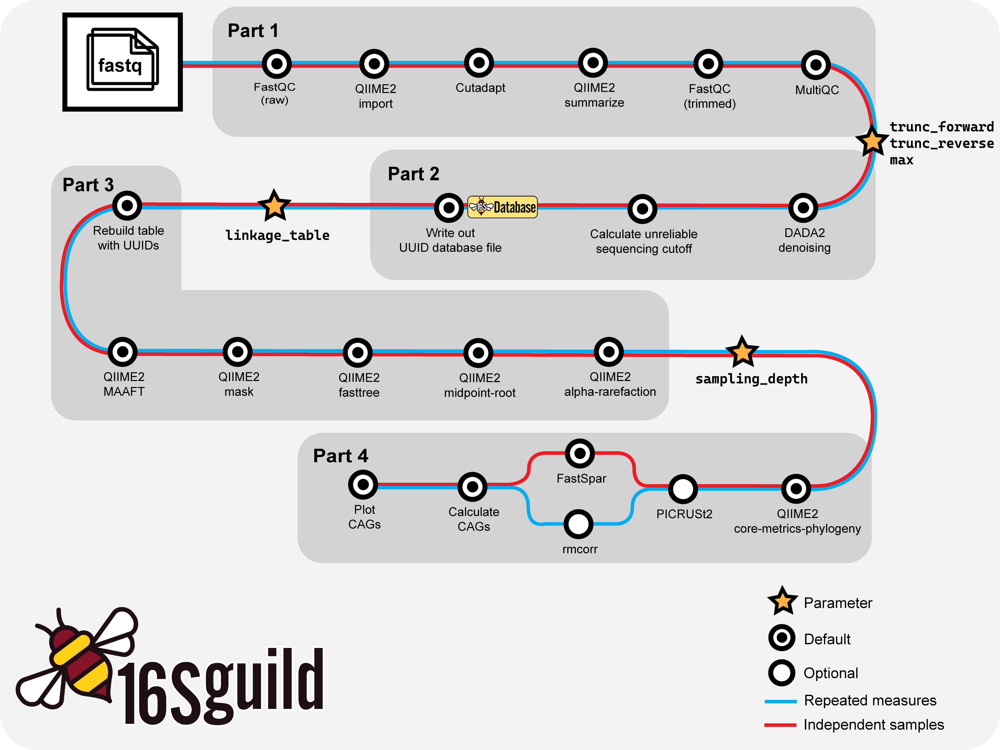

<div align="center">
    
</div>

# 16Sguild: Guild-based 16S-rRNA sequencing analysis pipeline

A Nextflow workflow for guild-based 16S-rRNA sequencing analysis such as introduced by [Wu and Zhao et al., 2021](https://genomemedicine.biomedcentral.com/articles/10.1186/s13073-021-00840-y).

<div align="center">
  <a href="https://biostats-dashboard.kumc.edu/16SguildDB/">
    
  </a>
</div>

---



*Basic workflow overview of 16Sguild pipeline.*

## Quick Start

Run directly from GitHub (suggested):

```bash
nextflow run zhao-microbiome-lab/16Sguild/main.nf -params-file examples/params.yml
```

Or, clone the repository and launch the pipeline:

```bash
git clone https://github.com/zhao-microbiome-lab/16Sguild.git
cd 16Sguild
nextflow run main.nf -params-file examples/params.yml
```

Detailed usage examples can be found in the [Basic Workflow documentation](basic-workflow.md).

> **Note:** The pipeline requires [Nextflow](https://www.nextflow.io/) (version 24.04.0 or later) and either [Docker](https://docs.docker.com/get-docker/) or [Singularity/Apptainer](https://apptainer.org/).

---

## Parameter Configuration

Parameters are supplied in a config file, e.g. `params.yml`. Here is an example of a completed `params.yml` file. At the end of each part, users will need to examine their data and fill in the required values before continuing with their analysis.

```bash
# Required initial parameters
samplesheet: "samplesheet.csv"
metadata: "metadata.tsv"
base_name: "base_name_dataset"
input_type: "SampleData[PairedEndSequencesWithQuality]"
input_format: "PairedEndFastqManifestPhred33"
trim_forward: "GTGCCAGCMGCCGCGGTAA"
trim_reverse: "GGACTACHVGGGTWTCTAAT"

# Required parameters updated based on data
# End of Part 1
trunc_forward: "xxx"
trunc_reverse: "xxx"
max: "xxx"

# End of Part 2
linkage_table: /path/to/file.txt

# End of Part 3
sampling_depth: "xxx"
```

An example parameters file is available in [`examples/params.yml`](examples/params.yml).

## Brief Parameter Descriptions

| Parameter | Description |
|-----------|-------------|
| `samplesheet` | Path to the CSV file containing sample information |
| `base_name` | String identifying the name of input folder |
| `input_type` | Semantic type required for the QIIME2 import function |
| `input_format` | Format of the data to import (e.g., "PairedEndFastqManifestPhred33") |
| `trim_forward` | Forward primer sequence to trim |
| `trim_reverse` | Reverse primer sequence to trim |
| `metadata` | Path to the sample metadata table (TSV format) |
| `trunc_forward` | Position at which to truncate forward reads in QIIME2 DADA2 (experiment-dependent) |
| `trunc_reverse` | Position at which to truncate reverse reads in QIIME2 DADA2 (experiment-dependent) |
| `linkage_table` | Table from [16Sguild database](https://biostats-dashboard.kumc.edu/16SguildDB/) assigning UUIDs to ASVs (experiment-dependent) |
| `max` | Maximum depth value used for alpha rarefaction (experiment-dependent) |
| `sampling_depth` | Rarefaction sampling depth for diversity analysis (experiment-dependent) |

---

## Project Structure

- `main.nf` – Main Nextflow pipeline
- `processes/` – Modular pipeline processes
- `16SguildR/` – Custom R package for downstream analysis
- `bin/` – Helper scripts (ensure they are executable)
- `lib/` – Definition script for end of part output
- `docs/` – Documentation for `16Sguild` pipeline
- `conf/` – Config profiles (e.g., for HPC, Docker, Singularity)
- `examples/` – Example input and config files
- `docker/` – Definition files for Singularity images automatically used in pipeline

---

## Containers

This pipeline uses the following containers by default (defined in `conf/default.config`):

- FastQC: `docker://biocontainers/fastqc:v0.11.9_cv8`
- MultiQC: `docker://multiqc/multiqc:latest`
- QIIME2: `docker://zhao-microbiome-lab/16sguild:qiime2_2024.2_1.0.0`
- FastSpar: `quay.io/biocontainers/fastspar:1.0.0--h7f8d780_0`
- R: `docker://zhao-microbiome-lab/16sguild:r_env_1.0.9`
- Picrust2: `quay.io/biocontainers/picrust2:2.6.2--pyhdfd78af_1`

No manual installation of software is needed—these containers are pulled automatically.

---

## Output

- All results are written to the `results/` directory by default.
- `results/main_results` contains output files from the pipeline.
- `results/database` contains the `.rds` file of the linkage table that can be uploaded to the [database](https://biostats-dashboard.kumc.edu/16SguildDB/).
- `results/visualizations` contains files that can be used on the [QIIME2 viewing platform](https://view.qiime2.org/).
- Intermediate files are preserved in the Nextflow work directory for reproducibility and in `results/intermediate_results` for easy access.
- Results files are symlinked by default. Users can set `publish.mode = 'copy'` to change this.

---

## Testing

Test the pipeline with example data:

```bash
nextflow run main.nf -profile test
```

The `test` profile runs a minimal dataset and can be used for continuous integration.

---

## Support

- For questions or issues, please [open an issue](https://github.com/zhao-microbiome-lab/16Sguild/issues).
- For feature requests, submit a new issue with the `enhancement` label.

---

## Citation

If you use this workflow, please cite:
- This repository: [zhao-microbiome-lab/16Sguild](https://github.com/zhao-microbiome-lab/16Sguild)
- Guild analysis: [Zhao, Wu, & Zhao, 2024](https://pubmed.ncbi.nlm.nih.gov/39225087/)
- Nextflow: [Di Tommaso et al. 2017](https://doi.org/10.1038/nbt.3820)

---

## License

Distributed under the MIT License. See [LICENSE](https://github.com/zhao-microbiome-lab/16Sguild/LICENSE) for details.
