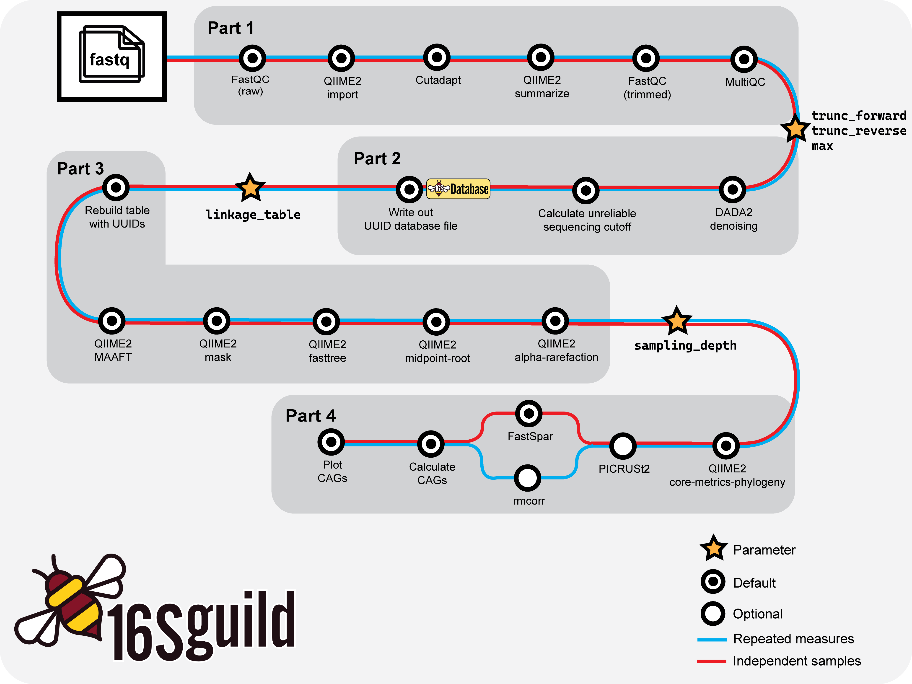

<div align="center">
    
</div>

# Installation

Installation guide for guild-based analysis of 16S-rRNA sequencing data based on [Wu and Zhao et al., 2021](https://genomemedicine.biomedcentral.com/articles/10.1186/s13073-021-00840-y).

<div align="center">
  <a href="https://biostats-shinyr.kumc.edu/16SguildDB/">
    
  </a>
</div>

---



*Basic workflow overview of 16Sguild pipeline.*

## Installation

The following sections detail dependencies and installation instructions for usage of the 16Sguild pipeline.

### Dependencies

**Nextflow**

To use 16Sguild, users must have Nextflow installed (version 25.04 through 26.04). Please see [Nextflow documentation](https://docs.seqera.io/nextflow/install) for installation instructions.

**Apptainer/Singularity/Docker**

16Sguild runs all tools inside containers, so users must have one of [Docker](https://docs.docker.com/get-docker/), [Singularity](https://docs.sylabs.io/guides/latest/user-guide/), or [Apptainer](https://apptainer.org/docs/user/latest/) installed and available on `PATH`. No manual installation of the underlying bioinformatics tools is required—containers are pulled automatically when the pipeline runs (see [Containers](index.md#containers) for the list of images used).

## Running 16Sguild

When launching the pipeline, tell Nextflow which container engine to use with the `-profile` flag: `docker`, `singularity`, or `apptainer`. HPC users can instead select one of the profiles defined in `conf/` (e.g. for SLURM); see your cluster's Nextflow configuration for details.

Run directly from GitHub (suggested):

```bash
nextflow run zhao-microbiome-lab/16Sguild/main.nf -params-file examples/params.yml -profile docker
```

Or, clone the repository and launch the pipeline:

```bash
git clone https://github.com/zhao-microbiome-lab/16Sguild.git
cd 16Sguild
nextflow run main.nf -params-file examples/params.yml -profile docker
```

## Verifying Your Installation

Confirm Nextflow and your container engine are installed and on `PATH`:

```bash
nextflow -version
docker --version   # or: singularity --version / apptainer --version
```

Then do a quick end-to-end run against the bundled test dataset:

```bash
nextflow run zhao-microbiome-lab/16Sguild/main.nf -profile test,docker
```

The `test` profile runs a minimal dataset and completing without errors confirms your Nextflow and container setup are working correctly.
